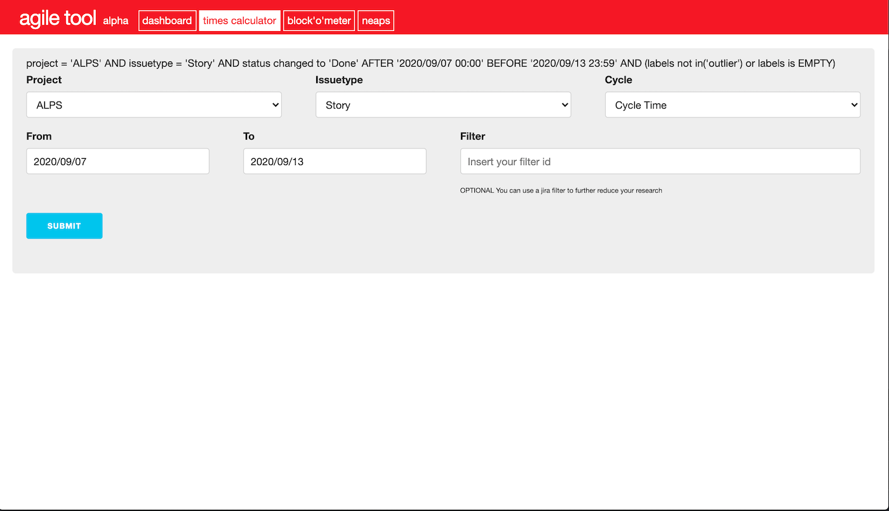
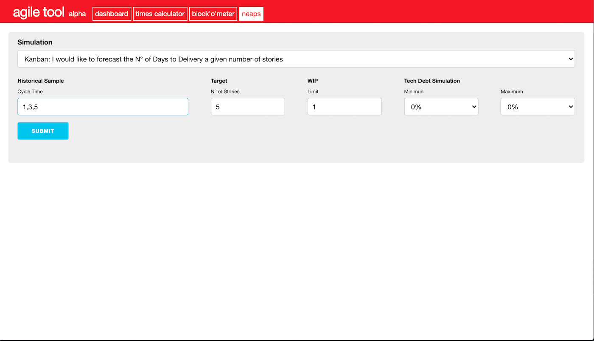

# Agile Tool

## TBD

## Overview
### Background
In the past, the Hotels.com Agile Community have been using different tools to collect metrics related to Teams and/or Projects.
The Agile Tool is meant to provide a single and consistent set of tools.

### Tools

- Dashboard: A tool that displays Team information at a glance.

- Times Calculator: A tool that collects and displays delivery metrics such as Throughput, Cycle Time etc.

- Block'o'meter: A tool that collects info on blocked Jira items such as block duration and reasons.

- NEAPS: No-Estimates Agile Process Simulator. A tool to forecast the end of a project using historical data as an input and leveraging on montecarlo simulations.

## Start using

You can easily run it locally by referring at the `README.md` found in [`agile-tool-spa`](https://github.com/HotelsDotCom/agile-tool/blob/master/agile-tool-spa/README.md) and [`agile-tool-api`](https://github.com/HotelsDotCom/agile-tool/blob/master/agile-tool-api/readme.md) directories.

## Documentation
Please refer to the `readme.md` found in `agile-tool-spa` and `agile-tool-api` directories.

## Credits
Created by [Giuseppe Sorrentino](https://github.com/glsorre).

## Legal
This project is available under the [Apache 2.0 License](http://www.apache.org/licenses/LICENSE-2.0.html).

Copyright 2018 Expedia Inc.